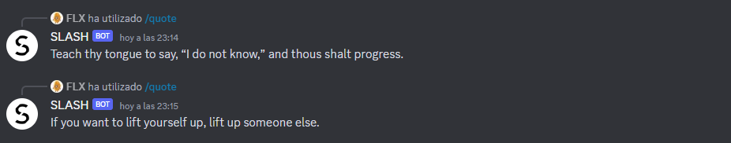
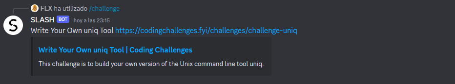
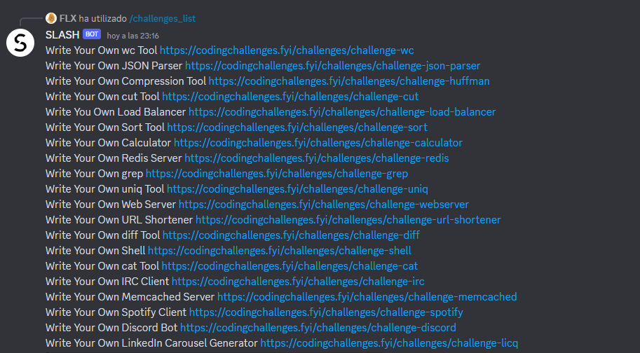
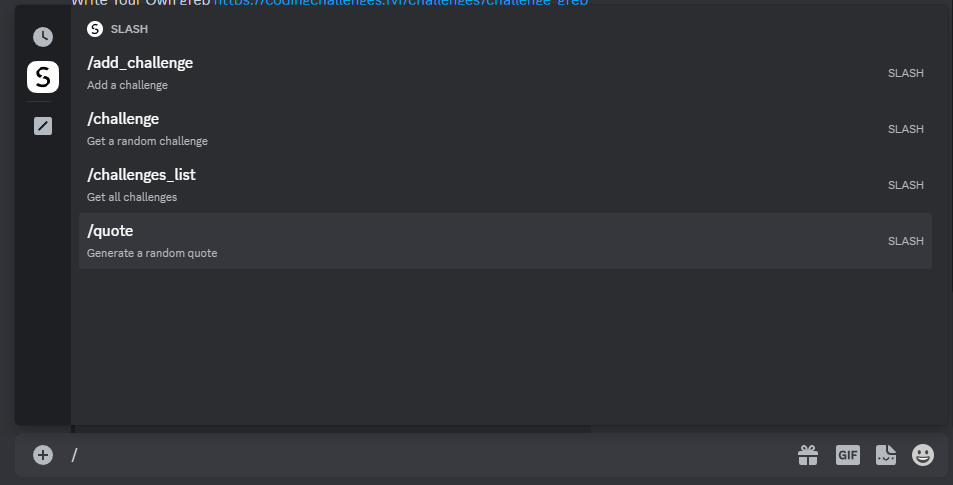

# Discord Bot (CodingChallenges.fyi)

Following the [codingchallenges.fyi](https://codingchallenges.fyi/challenges/challenge-discord) discord bot challenge.

I decided to build the bot in Python after so much time not using the language. Went with py-cord for the discord wrapper as it has extensive documentation. Instead of prefixing the commands with `!` I decided to use `/slash_commands`

## Features

Implemented all the commands from the challenge with the following names:

* `$hello` : bot answer is 'Hello {your_nickname}'
*  `/quote` : bot answers with a random quote from [dummyjson.com](https://dummyjson.com/)
*  `/challenge` : bot answers with a random challenge from [codingchallenges.fyi](https://codingchallenges.fyi/challenges)
*  `/challenges_list` : bot answers with a list of coding challenges
*  `/add_challenge` `url` : bot checks if it's a valid [codingchallenges.fyi](https://codingchallenges.fyi/challenges) challenge and adds it to the current list of challenges

## How to set up

* `python -m venv env` to create a virtual environment
* `source env/scripts/activate` to activate the virtual environment
* `pip install -r requirements.txt` to install all packages

## Built with (main packages)

* Py-cord
* BeautifulSoup
* Requests

## Screenshots

  
  
  
  

